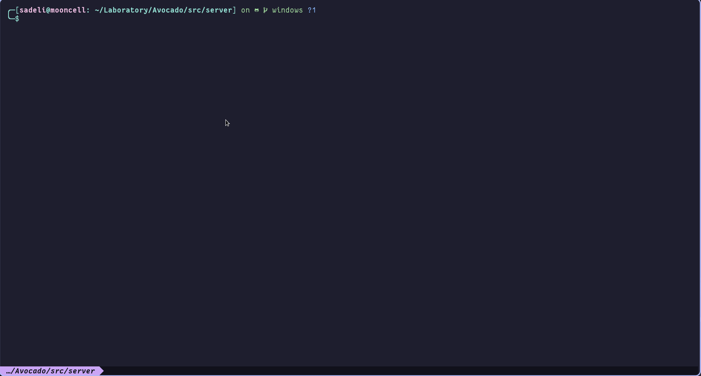
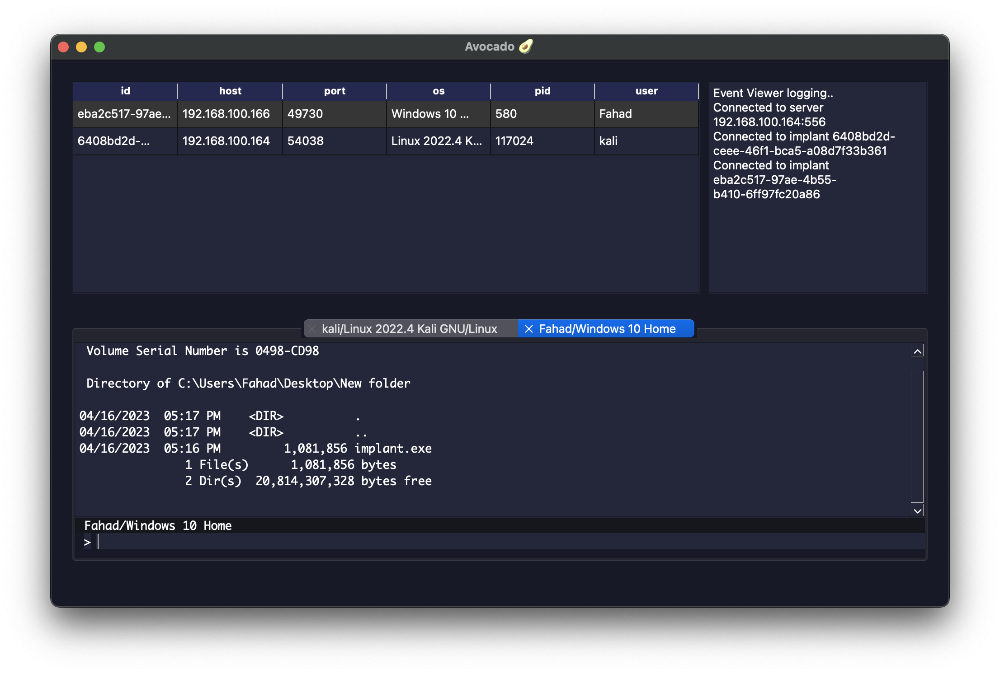

<h1 align="center">
  <picture>
    <source media="(prefers-color-scheme: dark)" srcset="https://user-images.githubusercontent.com/70419560/226087624-a4c6a4b6-11fc-4195-9878-cb19b6089b66.png">
    
  </picture>
  Avocado C2
</h1>

<p align="center">
  Avocado is a C2 framework currently in development. Expect bugs.
  <br>

  <!-- Open github issues -->
  <a href="https://github.com/ProDefense/Avocado/issues?q=is%3Aissue+is%3Aopen+">
    
  </a>

  <!-- Closed github issues -->
  <a href="https://github.com/ProDefense/Avocado/issues?q=is%3Aissue+is%3Aclosed">
    
  </a>

  <!-- License -->
  

  
</p>

## Quick Start

Avocado currently only supports a Docker installation.
1. **Build and run docker container**
```
$ docker build . -t avocado
$ docker run --rm --name avocado -it avocado
```

2. **Inside the container, run the server**
```
avocado$ cd src/server
avocado$ ./main.py
```

4. **On another terminal, run the the operator (only CLI operator is supported via Docker)**
```
$ docker exec -it avocado src/avocado-operator-cli
```

5. **Using the operator, compile and run the implant.**
```
[avocado] > generate <host:port> <linux|windows>
```

The implant will be output into the current working directory. If you wish to copy it to your local machine:
```
$ docker cp avocado:src/implant .
```

## GUI Operator


Only manual installation is supported for the GUI operator. See [operator README](src/client/README.md) for more instructions.
